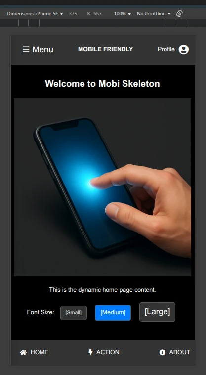

# mobi-skeleton

A mobile-friendly, HTMX-powered PHP web app skeleton – modular,
dark-themed, and easy to extend for phones, tablets, and desktops.

Created by Eddie Dunckley (Sir Edwin the Great) as a generic but
flexible starting point for rapid web app prototyping across devices.

## Features

- PHP backend with modular file-based structure (`mod/*.php`)
- Dark-themed UI with HTMX-driven interactivity
- Responsive layout for mobile, tablet, and PC
- No frameworks – just vanilla PHP, JS (jQuery), and CSS
- Instant loading via `hx-get`, `hx-swap`, and inline content targets
- Extensible: plug in your own forms, logic, or settings panels

## Reasoning / Explanation

Why another skeleton? Because when a client says,
"Quick, we need a mobile-first site!" the real battle is always the same:
menus that break at odd widths, footers that crawl over content, and CSS
breakpoints that explode on older phones. This repo is my bare-bones launch
pad – a tiny template you can clone, prove it works, then immediately hack
to pieces for your own needs.

Typical first-run workflow:

1. Assume you already have a web server (Apache, Nginx, etc.) with PHP
   enabled.
2. Confirm PHP is installed (fcgi or cli) and that ".php" files are routed
   through the PHP handler.
3. Drop the contents of mobi-skeleton into a web-visible directory, e.g.
   /var/www/html/mb/ (rename as you like).
4. Browse to https://your-site.org/mb/index.php (or just /mb/ if your
   server auto-indexes index.php) and confirm it renders.
5. Start editing – rip out what you dislike, bolt in what you need.
   Nothing here is sacred.
6. Lean on HTMX, jQuery, Tailwind, Bootstrap, or any template engine you
   fancy; this code is a starting block, not a framework.
7. Note: the code is bare-bones (Afrikaans "voetstoots") – sold as-is,
   no database layer, no auth, no templates beyond simple includes.
8. Add your own database (PostgreSQL, MariaDB, MySQL, SQLite, etc.),
   pick a template engine (Plates, Twig, Smarty, Mustache, Latte, Blade),
   and extend the JS as needed (jQuery keeps old Android 5+ phones alive
   in South Africa).
9. Ship it, iterate, and have fun.
10. Feeling grateful? Fuel my trance lab by streaming a track or two:
    https://youtube.com/eddiedunckley

## Included Modules

- `home`, `aboutus`, `contactus`
- `action1`, `action2` – generic placeholders with styled content
- `settings`, `accountsettings` – forms and sliders
- `support`, `help`, `termsconditions`, `privacypolicy`

## Requirements

- PHP 7.x or newer
- A web server (e.g., Apache, Nginx)
- Optional: local `.htaccess` support for pretty paths

## File Structure
.
├── index.php            # Entry point
├── mbstyle.css          # Shared dark theme CSS
├── mod/                 # All content modules
│   ├── home.php
│   ├── settings.php
│   └── ...
├── js/
│   └── mobiskel.js       # JS enhancements (e.g., menu)

**Profile Art Credits**
Our iconic alien mascot was born from a prompt by @deadlydud & @Aither,
realized by Google Imagen, and documented by @DeepSeek-AI.
Profile pic is Open-licensed (CC-BY 4.0)!

